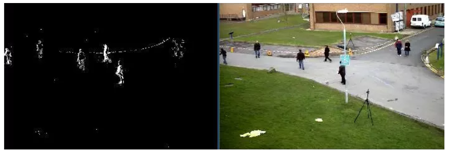

# 【基础】背景建模基本原理

背景建模是视频图像中运动目标检测的一种方法，其基本思想是对图像背景进行建模。一旦背景模型建立，将当前
的图像与背景模型进行某种比较，根据比较结果确定前景目标（需要检测的目标）。
其主要针对的是**摄像头固定场景**，可以对场景中**所有运动的动目标**进行检测。

## 1.帧差法

由于场景中的目标在运动，目标的影像在不同图像帧中的位置不同。该类算法对时间上连续的两帧图像进行差分运算，不同帧对应的像素点相减，判断灰度差的绝对值，当绝对值超过一定阈值时，即可判断为运动目标，从而实现目标的检测功能
帧差法非常简单但是会引入**噪声和空洞**问题。


## 2.混合高斯模型

在进行前景检测前，先对背景进行训练，对图像中每个背景采用一个混合高斯模型进行模拟，每个背景的混合高斯的个数可以自适应。然后在测试阶段，对新来的像素进行 GMM 匹配，如果该像素值能够匹配其中一个高斯，则认为是背景，否则认为是前景。由于整个过程 GMM 模型在不断更新学习中，所以对动态背景有一定的鲁棒性。最后通过对一个有树枝摇摆的动态背景进行前景检测，取得了较好的效果


背景的实际分布应当是多个高斯分布混合在一起，每个高斯模型也可以带有权重


### 混合高斯模型学习方法

1.首先初始化每个高斯模型矩阵参数。

2.取视频中 T 帧数据图像用来训练高斯混合模型。来了第一个像素之后用它来当做第一个高斯分布。

3.当后面来的像素值时，与前面已有的高斯的均值比较，如果该像素点的值与其模型均值差在 3 倍的方差内，则属于该分布，并对其进行参数更新。

4.如果下一次来的像素不满足当前高斯分布，用它来创建一个新的高斯分布。

### 混合高斯模型测试方法

在测试阶段，对新来像素点的值与混合高斯模型中的每一个均值进行比较，如果其差值在 2 倍的方差之间的话，则认为是背景，否则认为是前景。将前景赋值为 255，背景赋值为 0。这样就形成了一副前景二值图



# 【进阶】程序展示
```
import numpy as np
import cv2

#经典的测试视频
cap = cv2.VideoCapture('test.mp4')
#形态学操作需要使用
kernel = cv2.getStructuringElement(cv2.MORPH_ELLIPSE,(3,3))
#创建混合高斯模型用于背景建模
fgbg = cv2.createBackgroundSubtractorMOG2()

while(True):
    ret, frame = cap.read()
    fgmask = fgbg.apply(frame)
    #形态学开运算去噪点
    fgmask = cv2.morphologyEx(fgmask, cv2.MORPH_OPEN, kernel)
    #寻找视频中的轮廓
    contours, hierarchy = cv2.findContours(fgmask, cv2.RETR_EXTERNAL, cv2.CHAIN_APPROX_SIMPLE)

    for c in contours:
        #计算各轮廓的周长
        perimeter = cv2.arcLength(c,True)
        if perimeter > 188:
            #找到一个直矩形（不会旋转）
            x,y,w,h = cv2.boundingRect(c)
            #画出这个矩形
            cv2.rectangle(frame,(x,y),(x+w,y+h),(0,255,0),2)

    cv2.imshow('frame',frame)
    cv2.imshow('fgmask', fgmask)
    k = cv2.waitKey(150) & 0xff
    if k == 27:
        break

cap.release()
cv2.destroyAllWindows()
```