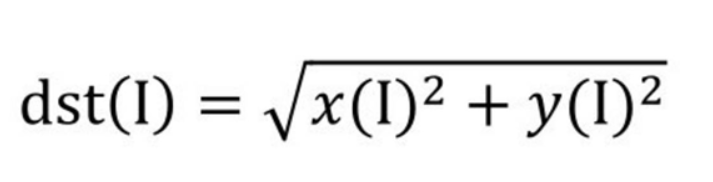
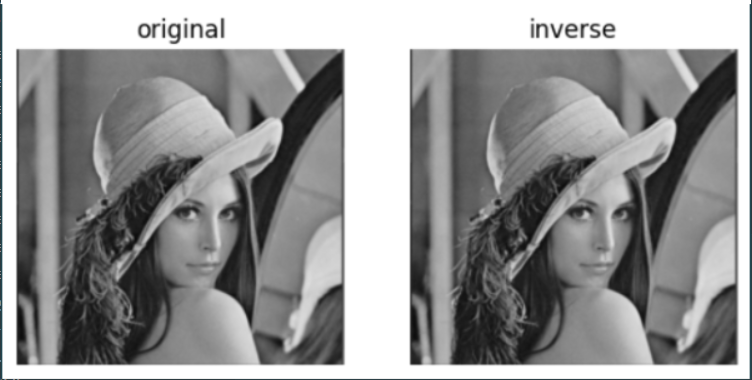

# 【基础】openCV实现傅里叶变换

openCV提供了函数cv2.dft()和cv2.idft()来实现傅里叶变换和逆傅里叶变换

## 1.傅里叶变换

  
经过函数cv2.dft()的变换后，得到了原始图像的频谱信息。

注意：  
1.对于参数“原始图像”，要首先使用np.float32()函数将图像转换成np.float32格式。  
2.“转换标识”的值通常为“cv2.DFT_COMPLEX_OUTPUT”，用来输出一个复数阵列。  
3.函数cv2.dft()返回的结果是双通道的，第1个通道是结果的实数部分，第2个通道是结果的虚数部分。


该语句将频谱图像dft中的零频率分量移到频谱中心，得到了零频率分量位于中心的频谱图像dftshift。
经此处理后，频谱图像还只是一个由实部和虚部构成的值。要将其显示出来，还要做进一步的处理。


函数cv2.magnitude()可以计算频谱信息的幅度。  
参数1：浮点型x坐标值，也就是实部。  
参数2：浮点型y坐标值，也就是虚部，它必须和参数1具有相同的size  

函数cv2.magnitude()的返回值是参数1和参数2的平方和的平方根



得到频谱信息的幅度后，通常还要对幅度值做进一步的转换，以便将频谱信息以图像的形式展示出来。简单来说，就是需要将幅度值映射到灰度图像的灰度空间[0, 255]内，使其以灰度图像的形式显示出来。

这里使用的公式为：


```
import numpy as np  
import cv2  
img = cv2.imread('lena.jpg',0)  
dft = cv2.dft(np.float32(img),flags = cv2.DFT_COMPLEX_OUTPUT)  
dftShift = np.fft.fftShift(dft)  
result = 20*np.log(cv2.magnitude(dftShift[:,:,1])) #两个参数，需要拆分通道  
```

经过上述程序,就实现了傅里叶变换

可以通过print展示其频谱信息

```
print(dft)  

print(dftShift)  

print(result)  
```

## 2.逆傅里叶变换

在OpenCV中，使用函数cv2.idft()实现逆傅里叶变换，该函数是傅里叶变换函数cv2.dft()的逆函数。其语法格式为：


注意: 在进行逆傅里叶变换后，得到的值仍旧是复数，需要使用函数cv2.magnitude()计算其幅度。

用OpenCV函数对图像进行傅里叶变换、逆傅里叶变换，并展示原始图像及经过逆傅里叶变换后得到的图像。

```
import cv2  
import numpy as np  
import matplotlib.pyplot as plt  

img=cv2.imread('lena.jpg',0)  
dft=cv2.dft(img_float32,flags=cv2.DFT_COMPLEX_OUTPUT)  
dftShift=np.fft.fftShift(dft)  

ishift = np.fft.ifftshift(dftshift)  
iImg = cv2.idft(ishift)  
iImg = cv2.magnitude(iImg[:,:,:0],iImg[:,:,:1]) #计算幅度  
plt.subplot(121),plt.imshow(img,cmap='gray')
plt.title('original'),plt.axis('off')
plt.subplot(122),plt.imshow(iImg,cmap='gray')
plt.title('inverse'),plt.axis('off')
plt.show()
```

