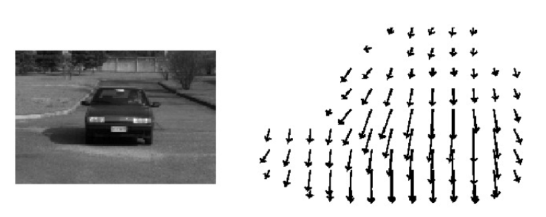

# 【基础】介绍

光流是空间运动物体在观测成像平面上的像素运动的“瞬时速度”，根据各个像素点的速度矢量特征，可以对图像进行动态分析，例如目标跟踪。

亮度恒定：同一点随着时间的变化，其亮度不会发生改变。

小运动：随着时间的变化不会引起位置的剧烈变化，只有小运动情况下才能用前后帧之间单位位置变化引起的灰度变化去近似灰度对位置的偏导数。

空间一致：一个场景上邻近的点投影到图像上也是邻近点，且邻近点速度一致。因为光流法基本方程约束只有一个，而要求x，y方向的速度，有两个未知变量。所以需要连立n多个方程求解。

亮度恒定，小运动，空间一致 是光流估计的三个前提

首先看一段视频

下面是我们对之前行人的视频进行光流估计，下面绘制出的白色轨迹就是光流估计的结果

