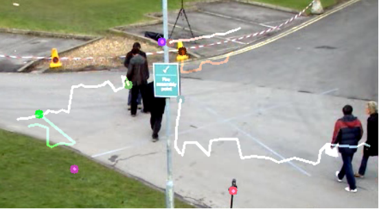

# 【基础】openCV实现光流估计

## 1.Lucas-Kanade方法进行光流估计

### cv2.calcOpticalFlowPyrLK(prevlmage, nextlmage, prevPts, None,winSize,maxLevel)

参数：

prevlmage：前一帧图像  
nextlmage：当前帧图像  
prevPts：待跟踪的特征点向量  
winSize：搜索窗口的大小  
maxLevel：最大的金字塔层数  

返回值：

nextPts：输出跟踪特征点向量  
status：特征点是否找到，找到为1，没找到为0  

## 2.角点检测方法

### cv2.goodFeaturesToTrack(img, mask=None, maxCorners, qualityLevel, minDistance)

通常来说角点可逆，非角点不可逆，所以我们每次进行光流估计前需要先进行角点检测

参数：
image：输入图像，是八位的或者32位浮点型，单通道图像，所以有时候用灰度图  
maxCorners：返回最大的角点数，是最有可能的角点数。如果这个参数不大于0，那么表示没有角点数的限制。按照角点强度降序排序，超过maxCorners的角点将被舍弃。  
qualityLevel：品质因子。筛选角点，品质因子越大，特征值越大的越好，得到的角点越少。检测出的角点强度值小于品质因子的会被抛弃。  
minDistance：返回的角点之间最小的欧式距离。在这个距离范围内判断哪个品质因子最好，只要这一个角点。  
mask：检测区域。如果图像不是空的(它需要具有CV_8UC1类型和与图像相同的大小)，它指定检测角的区域。  
blockSize：是协方差矩阵滤波的窗口大小。  
gradientSize：为sobel算子求微分的窗口的大小  
useHarrisDetector：选择是否采用Harris角点检测，默认是false.  
k：Harris检测的自由参数。  

返回值：  
corners：输出的角点坐标

## 3.程序演示

```
import cv2
import numpy as np
# 获取数据
video = cv2.VideoCapture('test.avi')
# 获取第一帧图像
ret,frame_one = video.read() 
gray_one = cv2.cvtColor(frame_one,cv2.COLOR_BGR2GRAY) #变成灰度图
# 角点检测，参数：输入图像，角点最大数量，品质因子，距离
p0 = cv2.goodFeaturesToTrack(gray_one, mask=None, maxCorners=100, qualityLevel=0.3, minDistance=7)
 
# 创建一个mask
mask = np.zeros_like(frame_one) # 全0的画板，size和第一帧图像一样大
# 轨迹线条颜色随机,[0,255)之间,输出size为(100,3)，三列对应颜色BGR
color = np.random.randint(0,255,(100,3))
 
#（3）视频处理
while True:
    ret,frame = video.read() # 返回是否打开和每一帧的结果
    frame_gray = cv2.cvtColor(frame,cv2.COLOR_BGR2GRAY)
    # 光流估计，需要传入前一帧和当前图像以及前一帧检测到的角点
    # gray_one代表前一帧，frame_gray当前帧图像，p0前一帧的角点，winSize窗口大小，maxLevel金字塔层数
    p1,st,err = cv2.calcOpticalFlowPyrLK(gray_one, frame_gray, p0, None,winSize=(15,15),maxLevel=2)
    # p1返回角点，st有些角点找到了有些没找到，err错误状态，用不上
    
    # st==1  角点找到了
    best_new = p1[st==1] # 当前帧，所有找到的角点
    best_old = p0[st==1] # 前一帧的角点
    
    # 绘制轨迹
    for i,(new,old) in enumerate(zip(best_new,best_old)): # 返回角点的下标和值
        a,b = new.ravel()  # 拉成一维，a等于x列，b等于y列
        c,d = old.ravel()
        a,b,c,d = np.array([a,b,c,d]).astype('int32') #输入的数据类型是整型
        # 背景图mask，起点坐标(a,b)，终点坐标(c,d)，变成列表列格式tolist()，线宽为2
        mask = cv2.line(mask, (a,b), (c,d), (color[i].tolist()), 2)
        # 画板frame，圆心位置(a,b)，圆半径5，'-1'代表实心圆
        frame = cv2.circle(frame,(a,b),5,color[i].tolist(),-1)
    # 图像叠加
    img = cv2.add(frame,mask)
    
    # 图像展示
    cv2.imshow('img',img)
    k = cv2.waitKey(150) & 0xff # 每张图停留150毫秒后消失
    if k == 27:  # ESC键退出
        break
    
    # 更新
    gray_one = frame_gray.copy() # 使下一次循环的前一帧变成当前帧图像
    p0 = best_new.reshape(-1,1,2) # -1的作用在于自动计算
# 释放资源
cv2.destroyAllWindows()


```



使用该方法的一些缺陷：第一帧的角点被第二帧利用，也被后续的所有帧运用，如果在第一帧没有出现A同学，那么在后续的帧中A同学出现了，那么也不会跟踪，因为使用的是前几帧的角点。一旦经过障碍物，就跟丢了。