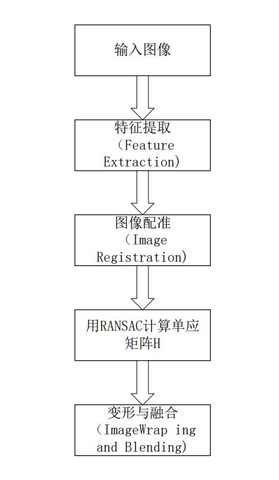

# 【基础】图像拼接简介

图像拼接是将同一场景的多个重叠图像拼接成较大的图像的一种方法，在医学成像、计算机视觉、卫星数据、军事目标自动识别等领域具有重要意义。图像拼接的输出是两个输入图像的并集。

## 1.图像拼接的分类

图像拼接目前有很多算法，图像拼接的质量，主要依赖于图像的配准程度，因此通过不同的图像匹配方式将算法分为以下两种：

## 2.基于区域相关拼接算法

该算法比较传统和普遍，从待拼接图像的灰度值出发，对待配准图像中一块区域与参考图像中的相同尺寸的区域使用最小二乘法或者其它数学方法**计算其灰度值的差异**对此差异比较后来判断待拼接图像**重叠区域的相似程度**，由此得到待拼接图像重叠区域的范围和位置，从而实现图像拼接。

## 3.基于特征相关拼接算法

于特征的配准方法不是直接利用图像的像素值，而是通过像素导出图像的特征，然后以图像特征为标准，对图像重叠部分的对应特征区域进行搜索匹配，该类拼接算法有比较高的健壮性和鲁棒性。

在两幅图像对应的特征集中利用特征匹配算法尽可能地将存在对应关系的特征对选择出来。一系列的图像分割技术都被用到特征的抽取和边界检测上。

# 【基础】图像拼接的基本步骤

通常用到五个步骤：

# 【基础】图像拼接的原理

## 1.特征匹配

特征是要匹配的两个输入图像中的元素，为了给图像提供更好的特征匹配，采用角点匹配，进行定量测量。在视点变化时，角点特征是稳定的。角点检测算法有Harris角点检测算法、SIFT特征点检测算法、FAST角点检测算法、SURF特征点检测算法。本次实验采用的是Opencv中的SIFT特征检测算法。

## 2.计算图像之间的变换结构

SIFT算法算出特征描述子

## 3.图像配准

在特征点被检测出来之后，这样子我们就可以得到了两幅待拼接图的匹配点集，接下来我们进行图像的配准，即将两张图像转换为同一坐标下，我们需要以某种方式将它们关联起来。
用RANSAC算法计算变换矩阵，RANSAC算法原理：从数据集中随机选取一组数据并认为是有效数据（内点）来确定待定参数模型，以此模型测试数据集中的所有数据，满足该模型的数据成为内点，反之为外点（通常为噪声、错误测量或不正确数据的点），迭代执行，直到某一个参数模型得到的内点数最大，则该模型为最优模型。在此应用于剔除错误匹配点，提高匹配的精度。

## 4.图像变形

图像变形是指将其中一幅图像的图像重投影，并将图像放置在更大的画布上。

## 5.图像融合

融合目的在于拼缝消除，图像融合是通过改变边界附近的图像灰度级，去除这些缝隙，创建混合图像，从而在图像之间实现平滑过渡。可以采取加权平均界限两侧各取一定的比例来融合缝隙。

<!--这是注释 markdown的标题
   #### 一级标题
   **** 二级标题
   ==== 三级标题
   ---- 四级标题
   ^^^^ 五级标题
   """" 六级标题
   -->
