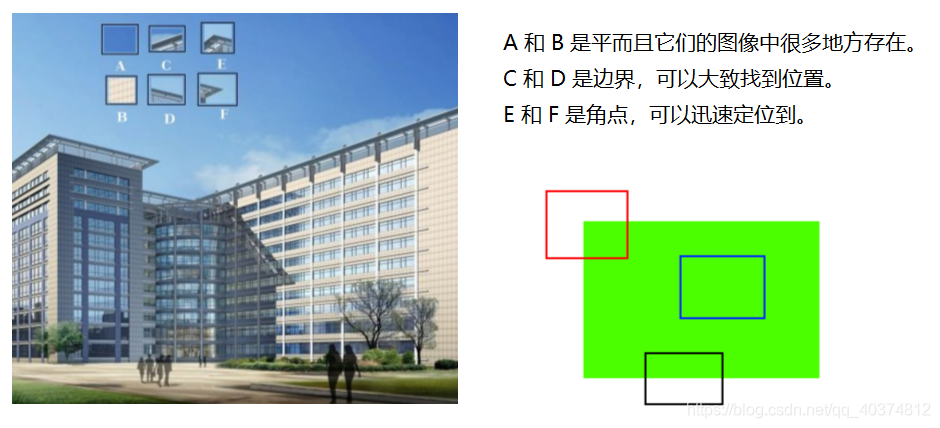
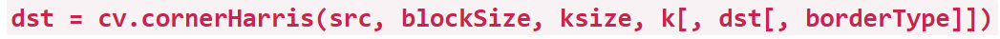
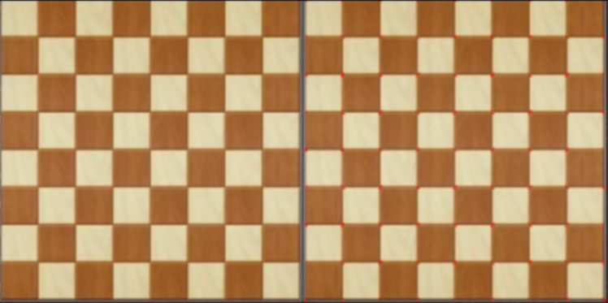

# 【基础】角点检测

## 1.角点检测算法基本思想

算法基本思想是使用一个固定窗口在图像上进行任意方向上的滑动，比较滑动前与滑动后两种情况，窗口中的像素灰度变化程度，如果存在任意方向上的滑动，都有着较大灰度变化，那么我们可以认为该窗口中存在角点。

### 例如



A和B处于平坦区域，没有什么确切的特征，它们所在的位置有很多种可能。

C和D要相对简单一些，它们是建筑物的边缘，我们可以找到一个大致的位置，但是要定位到精确的位置仍然很难。所以边缘是更好的特征，但还不够好。

E和F是建筑的一些角落，可以很容易地发现它们的位置，因为对于建筑物角落这个图像片段，我们不管朝哪个方向移动，这个片段看起来都会不一样。

## 2.OpenCV来实现Harris角点检测



参数：

src：输入单通道8位或浮点图像。

blockSize：它是考虑进行角点检测的邻域的大小

ksize：滑动核的大小。

k：角点响应值R计算公式中的α。 k: 取值参数[0.04,0.06] , 默认0.04即可

## 3.程序演示

```
import cv2  
import numpy as np  

img = cv2.imread('chessboard.jpg')
gray = cv2.cvtColor(img,cv2.COLOR_BGR2GRAY)  
gray = np.float32(gray)
dst = cv2.cornerHarris(gray,2,3,0.04)  
img[dst>0.01*dst.max()]=[0,0,255]  

cv2.imshow('dst',img)  
cv2.waitKey(0)  
cv2.destroyAllWindows()
```

