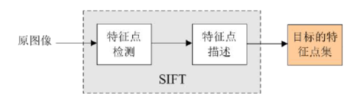

# 【基础】特征点检测

## 1.什么是特征点

特征点与角点在宏观定义上相同，都是能够表现图像中局部特征的像素。但是也有区别，特征点具有能够唯一描述像素特征的描述子。通常，特征点是由关键点和描述子组成的。

关键点就是图像中含有“关键信息”的像素。主要包括像素的位置、角度等信息。

描述子：用来唯一描述关键点的一串数字，又称为描述符，与每个人的个人信息相似。

注意：特征点是图像中含有特殊信息的像素，不仅包含像素的位置和角度，还包括描述像素唯一性的描述子。因此，通常认为特征点是关键点和描述子的组合


## 2.SIFT特征点检测

SIFT（尺度不变特征转换， ScaleInvariant Feature Transform） 是一种著名的尺度不变特征检测法。我们可以利用SIFT算法找到一幅图像中的一些稳定的保持不变性的局部特征点，该特征点被一个特殊向量描述。

SIFT特征的特点：

1.对旋转、尺度缩放、亮度变化保持不变性，对视角变化、噪声等也存在一定程度的稳定性；

2.独特性，信息量丰富，适用于在海量特征数据中进行快速，准确的匹配；

3.多量性，即使少数几个物体也可以产生大量的SIFT特征向量；

4.可扩展性，可以很方便的与其他形式的特征向量进行联合。



## 3.openCV实现SIFT

cv2.SIFT_create()：用于实例化sift

kp = sift.detect(gray, None)：检测灰度图像  ,  返回kp（关键点信息）

cv2.drawKeypoints(image, keypoints, outputimage, color, flags)：用于画出找到的关键点

image：原始图像

keypoints：找到的关键点，即kp

outputimage：输出图片，可以是原始图像

flags：绘图功能的标识设置

## 4.程序演示

```
import cv2
import numpy as np

img = cv2.imread('lena.jpg')  
gray = cv2.cvtColor(img,cv2.COLOR_BGR2GRAY)  
sift = cv2.SIFT_create()  
kp = sift.detect(gray,None)     #sift.detect():得到特征点  
img = cv2.drawKeypoints(gray,kp,img)  

cv2.imshow('drawKeypoints',img)
cv2.waitKey(0)
cv2.destroyAllWindows()
```

