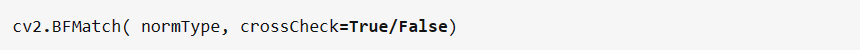
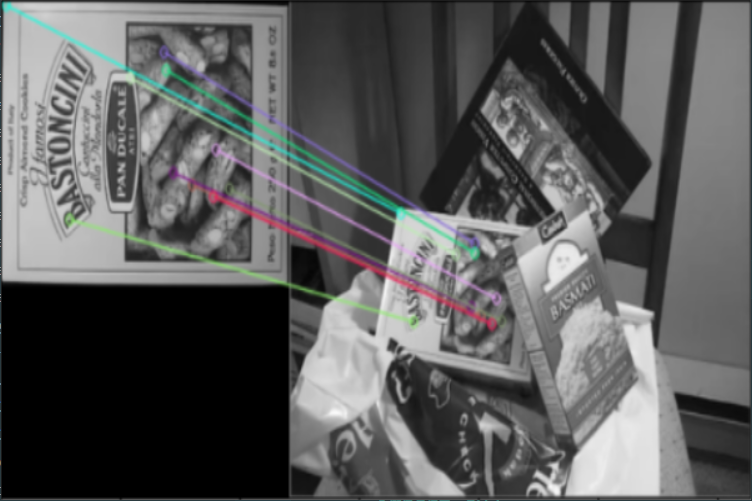

# 【基础】特征匹配

## 1.openCV实现Brute-Force 蛮力匹配



normType：是用来指定要使用的距离测试类型。方式不同的算法对应的默认值不同。

crossCheck：默认值是False。如果设置为True，匹配条件会更加严格。举例来说，如果A图像中的i点和B图像中的j点距离最近，并且B中的j点到A中的i点距离也最近，相互匹配，这个匹配结果才会返回。


## 2.程序演示

```
import cv2  
import numpy as np  
import matplotlib.pyplot as plt  

img1 = cv2.imread('book.jpg',0)  
img2 = cv2.imread('books.jpg',0)  
sift = cv2.SIFT_create()  #SIFT(Scale-invariant feature transform：尺度不变特征变换)用来侦测与描述影像中的局部性特征  
kp1,des1 = sift.detectAndCompute(img1,None)  
kp2,des2 = sift.detectAndCompute(img2,None)  
bf = cv2.BFMatcher(crossCheck=True)  
matches = bf.match(des1,des2)  
matches = sorted(matches,key=lambda x:x.distance)  
# sorted(iterable：表示指定的序列，key：参数的自定义排序规则，reverse：指定参数升序或降序排列，默认为False降序)
#lambda：是一个自定义函数

img3 = cv2.drawMatches(img1,kp1,img2,kp2,matches[:10],None,flags=2)  #matches【：10】 ： 表示序列前十
plt.imshow(img3)
```

